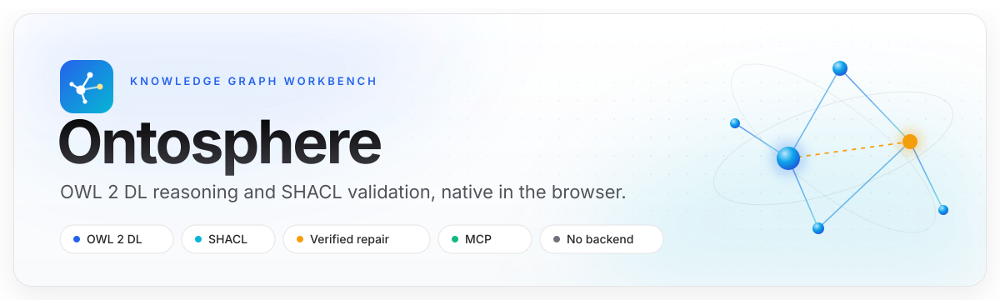
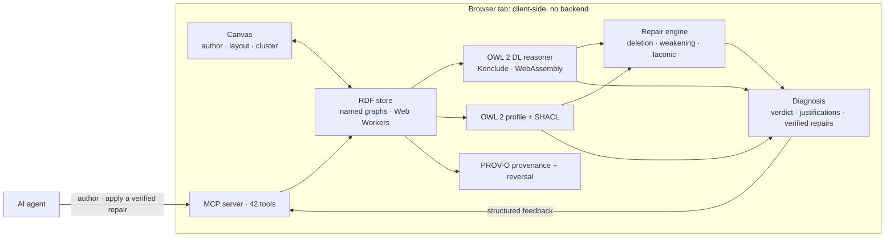

<div align="center">

<picture>
  <source media="(prefers-color-scheme: dark)" srcset="docs/assets/header-dark.svg">
  
</picture>

<br><br>

[](https://thhanke.github.io/ontosphere)
[](https://github.com/ThHanke/ontosphere/tags)
[](https://doi.org/10.5281/zenodo.19605270)
[](LICENSE)

[](#ai-agents)

<strong>
<a href="https://thhanke.github.io/ontosphere">Live app</a>
&nbsp;·&nbsp;
<a href="#tutorials">Tutorials</a>
&nbsp;·&nbsp;
<a href="#ai-agents">AI agents</a>
&nbsp;·&nbsp;
<a href="#run-locally">Run locally</a>
&nbsp;·&nbsp;
<a href="#evaluation">Evaluation</a>
&nbsp;·&nbsp;
<a href="#citation">Cite</a>
</strong>

</div>

<br>

**Ontosphere** is a browser-native workbench for RDF knowledge graphs. It loads RDF from files, URLs or SPARQL endpoints, lets you author nodes and edges on a live canvas, classifies the graph with an OWL 2 DL reasoner (Konclude compiled to WebAssembly), validates it with SHACL over the asserted and inferred graphs, and proposes reasoner-verified repairs. Every operation is also available to AI agents through a Model Context Protocol server. There is no backend and nothing to install: it runs in a browser tab.

<table>
<tr>
<td width="33%" valign="top">
<strong>Reason</strong><br>
<sub>OWL 2 DL classification and realisation in the browser. Inferred triples live in their own named graph, render inline, and are identical from one run to the next.</sub>
</td>
<td width="33%" valign="top">
<strong>Validate</strong><br>
<sub>SHACL over asserted plus inferred data, including SPARQL constraints. Reports list the shapes that selected a focus node, so a shape that checked nothing is visible.</sub>
</td>
<td width="33%" valign="top">
<strong>Repair</strong><br>
<sub>Deletion and axiom-weakening repairs, each verified with the reasoner, with the option to measure which disjointness constraints a repair would remove.</sub>
</td>
</tr>
<tr>
<td width="33%" valign="top">
<strong>Author</strong><br>
<sub>Canvas editing with ontology-aware autocomplete, TBox and ABox views, layered and force layouts, clustering and full undo.</sub>
</td>
<td width="33%" valign="top">
<strong>Share</strong><br>
<sub>TriG, N-Quads and JSON-LD export keep asserted, inferred and shape graphs apart; RDF canonicalisation gives a content hash.</sub>
</td>
<td width="33%" valign="top">
<strong>Connect agents</strong><br>
<sub>42 typed MCP tools, a relay for chat assistants, an <a href="llms.txt">llms.txt</a>, and PROV-O provenance with reversal of every agent edit.</sub>
</td>
</tr>
</table>

<br>

## Contents

<table>
<tr>
<td width="33%" valign="top">
<strong>Use</strong><br>
<a href="#how-it-fits-together">How it fits together</a><br>
<a href="#capabilities">Capabilities</a><br>
<a href="#tutorials">Tutorials</a><br>
<a href="#the-interface">The interface</a><br>
<a href="#reasoning">Reasoning</a><br>
<a href="#shacl-validation">SHACL validation</a><br>
<a href="#loading-data">Loading data</a>
</td>
<td width="33%" valign="top">
<strong>Integrate</strong><br>
<a href="#ai-agents">AI agents</a><br>
<a href="#tool-surface">Tool surface</a><br>
<a href="#agent-edit-provenance">Agent edit provenance</a><br>
<a href="#chat-assistants-ai-relay">Chat assistants</a><br>
<a href="#automation">Automation</a>
</td>
<td width="33%" valign="top">
<strong>Develop</strong><br>
<a href="#run-locally">Run locally</a><br>
<a href="#evaluation">Evaluation</a><br>
<a href="#reproducibility">Reproducibility</a><br>
<a href="#citation">Citation</a><br>
<a href="#acknowledgements">Acknowledgements</a>
</td>
</tr>
</table>

<br>

## How it fits together



An agent, or a person on the canvas, edits the store. The reasoner and the SHACL validator check it, and the result comes back as one structured diagnosis with reasoner-verified repairs. Nothing leaves the browser.

<br>

## Capabilities

| Area | What you get |
|---|---|
| **Load** | RDF from local files, URLs, SPARQL endpoints and Fuseki datasets: Turtle, N-Triples, N-Quads, TriG, RDF/XML and JSON-LD. `owl:imports` are followed automatically, and a URL parameter can load data on startup. |
| **Author** | Always-on editing on a Reactodia canvas: add nodes from search, draw edges from a node's halo, edit annotations inline, undo and redo. Autocomplete is ranked by the domains and ranges of the loaded ontologies. |
| **Explore** | TBox and ABox views, label and IRI search, Dagre and ELK layouts computed in Web Workers, structural folding, and community-detection clustering (Label Propagation, Louvain, K-Means) above a configurable size. |
| **Reason** | OWL 2 DL inference with Konclude. Consistency, classification, realisation, unsatisfiable classes, inconsistency justifications (MIPS) with laconic refinement, and OWL 2 profile detection (EL, QL, RL, DL). Inferred edges are drawn amber and dashed. |
| **Validate** | SHACL over asserted plus inferred data, with focus node, path, constraint and severity for every result, and per-shape focus-node counts so a conforming report can be told apart from shapes that selected nothing. |
| **Repair** | A Repairs tab with ranked, reasoner-verified fixes: a minimal hitting set of deletions and, for `rdfs:subClassOf` culprits, axiom weakening that replaces `A ⊑ D` with a weaker `A ⊑ D′` (Troquard et al. 2018; Li and Lambrix 2024). Each deletion can also be measured for the disjointness constraints it would remove. |
| **Share** | Turtle and RDF/XML, or N-Quads, TriG and JSON-LD that preserve every named graph. W3C RDFC-1.0 canonicalisation with a SHA-256 content hash. VoID and DCAT dataset metadata. |
| **Track** | Every agent edit is recorded as PROV-O, with a diff and one-click reversal per batch. |

<br>

## Tutorials

Short walkthroughs that play directly from the live deployment. Each feature video uses the bundled reasoning-demo ontology.

| Feature | Video | What you will see |
|---|---|---|
| RDF loading | [feat-loading.mp4](https://thhanke.github.io/ontosphere/demo-videos/feat-loading.mp4) | URL parameter, file upload, SPARQL endpoint |
| Visual exploration | [feat-exploration.mp4](https://thhanke.github.io/ontosphere/demo-videos/feat-exploration.mp4) | TBox and ABox, search, zoom, minimap |
| Canvas authoring | [feat-authoring.mp4](https://thhanke.github.io/ontosphere/demo-videos/feat-authoring.mp4) | Add a class, draw an edge, edit annotations, undo |
| Clustering | [feat-clustering.mp4](https://thhanke.github.io/ontosphere/demo-videos/feat-clustering.mp4) | Structural folding and Louvain communities |
| OWL 2 DL reasoning | [feat-reasoning.mp4](https://thhanke.github.io/ontosphere/demo-videos/feat-reasoning.mp4) | Inference, inferred triples, ABox inspection |
| SHACL validation | [feat-shacl.mp4](https://thhanke.github.io/ontosphere/demo-videos/feat-shacl.mp4) | Shapes, validation, interplay with reasoning |
| MCP and AI relay | [feat-ai-relay.mp4](https://thhanke.github.io/ontosphere/demo-videos/feat-ai-relay.mp4) | Bookmarklet, tool calls, relay round trip |

Longer sessions show an agent building an ontology end to end.

| Session | Video | Description |
|---|---|---|
| Full walkthrough | [iswc2026-comprehensive.mp4](https://thhanke.github.io/ontosphere/demo-videos/iswc2026-comprehensive.mp4) | A three-minute tour of every feature |
| FOAF social network | [foaf-social-network.mp4](https://thhanke.github.io/ontosphere/demo-videos/foaf-social-network.mp4) | An agent builds a social graph and reasons over it |
| Scene ontology | [scene-ontology.mp4](https://thhanke.github.io/ontosphere/demo-videos/scene-ontology.mp4) | A film-scene ontology on BFO and RO |
| Pizza tutorial | [pizza-tutorial.mp4](https://thhanke.github.io/ontosphere/demo-videos/pizza-tutorial.mp4) | The Manchester Pizza ontology: hierarchy, disjointness, reasoning |
| Pizza tutorial as a lesson | [pizza-tutorial-chat.mp4](https://thhanke.github.io/ontosphere/demo-videos/pizza-tutorial-chat.mp4) | The same tutorial taught by an AI tutor, side by side |

<br>

## The interface


<details>
<summary><strong>Element reference</strong></summary>

<br>

**Top bar, left**

| # | Element | Purpose |
|---|---|---|
| 1 | View menu | Export the canvas as PNG or SVG, print, show or hide the namespace legend. |
| 2 | Search | Find entities by label or IRI; arrow keys or Enter cycle through matches. |

**Top bar, right**

| # | Element | Purpose |
|---|---|---|
| 3 | Layout | Choose Dagre (horizontal, vertical), ELK (layered, force, stress, radial) or the default layout, set spacing, toggle auto-layout. |
| 4 | Clustering | None, Label Propagation, Louvain or K-Means. Auto-clustering runs above the large-graph threshold (100 nodes by default). |
| 5 | Fold level | Step through community clusters, structural folding, hidden annotations and the fully expanded view. |
| 6 | A-Box | Show instance-level individuals. |
| 7 | T-Box | Show classes and properties. |
| 8 | Ontologies | Loaded ontologies, with options to add or remove them from autoload. |
| 9 | Reasoning status | Ready, valid, warnings, errors, or running. Opens the reasoning report. |
| 10 | Clear inferred | Remove inferred triples without touching asserted data. |
| 11 | SHACL toggle | Include SHACL validation when reasoning runs. |
| 12 | Run reasoning | Reason with Konclude and, if enabled, validate. Idempotent. |

**Left sidebar**

| # | Element | Purpose |
|---|---|---|
| 13 | Onto | Load an ontology from a URL or a configured source. |
| 14 | File | Load a local Turtle, JSON-LD, RDF/XML or N-Triples file. |
| 15 | Clear | Remove all graphs and reset the canvas. |
| 16 | Export | Turtle, RDF/XML, or N-Quads, TriG and JSON-LD with named graphs, generated in the browser. |
| 17 | SHACL | Load, inspect and manage shapes. |
| 18 | Agent Edits | Browse, diff and revert agent edit batches. |
| 19 | SPARQL | Query editor with registered prefixes; results render as a table, triples or a boolean. |
| 20 | Metrics | Structural counts, namespace breakdown and quality heuristics. |
| 21 | AI Relay | Connect a chat assistant through the bookmarklet. |
| 22 | Zoom controls | Zoom, fit to view, and export the current view. |
| 23 | Docs | Built-in documentation. |
| 24 | Settings | Layout, clustering, thresholds, autoload, workflows, reasoner backend. |

**Authoring toolbar and canvas**

| # | Element | Purpose |
|---|---|---|
| 25 | Undo | Undo the last authoring change. |
| 26 | Redo | Redo the last undone change. |
| 27 | Save | Commit pending edits to the store in one batch. |
| 28 | Re-layout | Re-apply the current layout. |
| 29 | Individual node | An RDF subject with its local name, namespace badge and class; properties are editable on selection. |
| 30 | Edge | A labelled predicate; amber dashed edges are inferred. Double-click to edit. |
| 31 | Minimap | Click to jump, drag to pan. |

A selected node shows a halo: **Edit** opens the property editor, **Delete** removes the entity from the store, **Remove** hides it from the canvas only, **Establish Link** drags a new edge to another node, and **Expand** loads its neighbours.

</details>

<br>

## Reasoning

Reasoning runs in the browser through a pluggable backend. The default is **Konclude**, a tableau-based reasoner for SROIQ(D), the description logic behind OWL 2 DL, compiled to WebAssembly. It checks consistency, classifies the ontology, realises individuals and writes the results to `urn:vg:inferred`. Running it again on an unchanged graph produces the same inferred graph, and **Clear inferred** removes it without touching asserted data. The [reasoning video](https://thhanke.github.io/ontosphere/demo-videos/feat-reasoning.mp4) walks through fifteen OWL 2 DL patterns.

When the ontology is inconsistent, reasoning stops and the report's **Errors** tab lists each clash: the individual, the axioms involved and a description. Typical causes are an individual in two disjoint classes, a violated `owl:allValuesFrom`, or an asymmetric or irreflexive property cycle.

Blank nodes are stored as `urn:vg:bnode:*` IRIs and restored to blank nodes before reasoning, so restrictions, intersections and other class expressions are reasoned over exactly as written.

<details>
<summary><strong>Supported constructs and the N3 backend</strong></summary>

<br>

Konclude handles `rdfs:subClassOf`, `owl:equivalentClass`, `owl:someValuesFrom`, `owl:allValuesFrom`, `owl:hasValue`, `owl:inverseOf`, symmetric and transitive properties, `rdfs:subPropertyOf`, `rdfs:domain` and `rdfs:range`, `owl:intersectionOf`, `owl:unionOf`, `owl:oneOf`, `owl:propertyChainAxiom`, number restrictions and nominals.

The **N3 Rules** backend uses the N3.js reasoner with rule files from `public/reasoning-rules/`; select it in *Settings, Reasoner Backend*. It matches basic graph patterns only: rules that need EYE built-ins (`e:findall`, `list:in`, `log:notEqualTo`) are ignored and marked `[REQUIRES EYE]` in the rule files. It does not check consistency.

</details>

<br>

## SHACL validation

Ontosphere validates data against [SHACL](https://www.w3.org/TR/shacl/) shapes over the asserted and inferred graphs together, so a shape whose target class is only inferred still applies once reasoning has run. Results appear in the reasoning report beside OWL findings, with **SHACL** and **OWL** badges, and as red or amber badges on the affected nodes. Only `sh:Violation` marks data invalid; warnings and info do not.

Property shapes and SPARQL-based constraints (`sh:sparql`) are both evaluated. Declare `sh:severity` on the shape itself, not inside the `sh:sparql` node, as the SHACL specification requires.

Every report also says how many shapes selected a focus node. A report that conforms while no shape selected anything has checked nothing, and the counts make that visible.

| Loading shapes | |
|---|---|
| `?shaclShapes=` URL parameter | A `.ttl` URL, a GitHub folder URL, or a comma-separated list, loaded on startup |
| Settings, SHACL tab | A saved shapes URL, loaded on startup when no `?shaclShapes=` is given, with bundled presets |
| `loadShaclFromUrl` tool | Loading driven by an agent |

Shapes go into `urn:vg:shapes`, which is never reasoned over. Loading from the Settings tab or with `loadShaclFromUrl` replaces the shapes already there; `loadShacl` adds to them. Startup shapes are a default: they are applied only if the shapes graph is still empty once they have been fetched, so shapes loaded right after opening the app are kept.

| Bundled preset | Targets | Checks |
|---|---|---|
| Ontology quality | `owl:Class`, `owl:ObjectProperty`, `owl:DatatypeProperty` | labels, comments, domains, ranges |
| SKOS quality | `skos:Concept`, `skos:ConceptScheme` | preferred labels, scheme membership |
| Reasoning demo | `ex:Project`, `ex:Contractor`, `ex:Employee`, `owl:NamedIndividual` | descriptions, supervisors, job titles |

[Open the SHACL demo](https://thhanke.github.io/ontosphere/?rdfUrl=https://raw.githubusercontent.com/ThHanke/ontosphere/refs/heads/main/public/reasoning-demo.ttl&shaclShapes=https://raw.githubusercontent.com/ThHanke/ontosphere/refs/heads/main/public/shacl-shapes/reasoning-demo.shacl.ttl) and run reasoning: the report shows 2 violations (`projectAlpha` without `rdfs:comment`, `frank` without `ex:hasSupervisor`) and 12 warnings, each linked to its node.

<br>

## Loading data

URL parameters control what loads on startup. All mechanisms are additive and run in this order: configured autoload ontologies, the data URL, ontologies from `?ontology=`, then `owl:imports` discovery.

| Parameter | Description |
|---|---|
| `rdfUrl` (also `url`, `vg_url`) | An RDF document, a SPARQL endpoint (a path ending in `/sparql` or `/query`, queried with `CONSTRUCT`), or a Fuseki dataset root. |
| `apiKey`, `apiKeyHeader` | A credential sent with the data request only, in the named header (default `Authorization`). The server must allow the Ontosphere origin with credentials. |
| `ontologies` | Replace the autoload list, for example `?ontologies=owl,rdf,rdfs`. |
| `ontology` | Add to the autoload list, for example `?ontology=bfo,dcat`. |
| `loadImports` | `false` disables `owl:imports` discovery for the session. |
| `shaclShapes` | Shapes to load on startup, overriding the configured URL for the session. Applied only if no shapes have been loaded by then. |

```text
https://thhanke.github.io/ontosphere/?rdfUrl=https://example.org/data.ttl&ontology=bfo2020&shaclShapes=https://example.org/shapes.ttl
```

<details>
<summary><strong>Well-known ontology short names</strong></summary>

<br>

| Short name | Ontology |
|---|---|
| `rdf`, `rdfs`, `owl` | W3C core vocabularies |
| `skos` | SKOS |
| `prov` | PROV-O |
| `p-plan` | P-Plan |
| `bfo`, `bfo2020` | Basic Formal Ontology 2.0 and 2020 |
| `dcat` | Data Catalog Vocabulary |
| `foaf` | FOAF |
| `dcterms` | Dublin Core Terms |
| `qudt` | QUDT |
| `iof-core` | IOF Core |

A private dataset behind a Fuseki SPARQL endpoint loads with `?rdfUrl=https://host/dataset/<id>/fuseki/$/sparql&apiKey=<token>`.

</details>

<br>

## AI agents

Ontosphere exposes its operations as a [Model Context Protocol](https://modelcontextprotocol.io) tool surface. The store is the source of truth and the canvas is its view: tools write triples, reasoning writes inferences back, and the canvas refreshes. Place a subject on the canvas with `addNode`; `expandNode` reveals its annotation properties.

Agents that discover projects through [`llms.txt`](llms.txt) find the same tool list, graph model and workflow described there, kept in step with the code by a test. The full schemas are published at [`/.well-known/mcp.json`](https://thhanke.github.io/ontosphere/.well-known/mcp.json).

### Tool surface

| Category | Tools |
|---|---|
| Graph and export | `loadRdf` · `loadOntology` · `suggestOntologiesForTask` · `queryGraph` · `exportGraph` · `canonicalizeGraph` · `exportImage` · `setViewMode` · `getCapabilities` · `getGraphState` · `help` |
| Nodes | `addNode` · `removeNode` · `expandNode` · `getNodes` · `getNodeDetails` · `updateNode` · `searchTerms` |
| Links | `addTriple` · `removeLink` · `getLinks` |
| Layout and navigation | `runLayout` · `clusterNodes` · `layoutNodes` · `focusNode` · `fitCanvas` · `getNeighbors` · `findPath` |
| Reasoning and diagnosis | `runReasoning` · `clearInferred` · `explainDiagnostics` · `explainEntailment` |
| Namespaces | `setNamespace` · `removeNamespace` · `listNamespaces` |
| SHACL | `loadShacl` · `validateGraph` · `loadShaclFromUrl` |
| Provenance | `listAgentEdits` · `diffAgentEdits` · `revertAgentBatch` |
| Metadata | `generateDatasetMetadata` |

A typical session:

```text
loadOntology       vocabulary into urn:vg:ontologies
searchTerms        reuse existing IRIs
loadRdf / addNode / addTriple
runReasoning       consistency, classification, realisation
validateGraph      SHACL over asserted + inferred, with focus-node counts
explainDiagnostics justifications and verified repairs (assessGuardCost: true adds guard cost)
removeLink         apply the verified repair set, then reason again
exportGraph trig   asserted, inferred and shape graphs kept apart
```

Two results deserve care. A repair's `verifiedConsistent` says whether removing that one axiom alone restores consistency; with several independent contradictions it is false for every correct repair, so trust `repairSetVerifiedConsistent`, which covers the whole set. A `guardImpact` verdict of `restores-consistency-with-collateral` means the repair works by deleting a constraint the ontology used to reject errors with.

### Agent edit provenance

Every mutating tool call is recorded as a PROV-O edit batch in `urn:vg:provenance`.

| Tool | Purpose |
|---|---|
| `listAgentEdits` | Edit batches, most recent first, with tool, agent, time and counts |
| `diffAgentEdits` | The exact triples a batch added and removed |
| `revertAgentBatch` | Undo a batch, faithful to typed and language-tagged literals |

The **Agent Edits** panel shows the same journal with added and removed triples and a revert button per batch. The journal is excluded from reasoning, validation and export, lives in memory, is cleared on reload, and keeps the most recent 5,000 edits.

[](docs/mcp-demo/foaf-social-network.md)

| Demo | Final state |
|---|---|
| **[FOAF social network](docs/mcp-demo/foaf-social-network.md)**<br><sub>Build a social network, extend FOAF with employment classes, reason</sub> | [](docs/mcp-demo/foaf-social-network.md) |
| **[DL reasoning](docs/mcp-demo/reasoning-demo.md)**<br><sub>TBox and ABox, types inferred from domains, ranges and transitivity</sub> | [](docs/mcp-demo/reasoning-demo.md) |
| **[Scene ontology](docs/mcp-demo/scene-ontology.md)**<br><sub>Load an external ontology, author individuals, export Turtle</sub> | [](docs/mcp-demo/scene-ontology.md) |
| **[Pizza tutorial](docs/mcp-demo/pizza-tutorial.md)**<br><sub>Classes, disjointness, properties and reasoning</sub> | [](docs/mcp-demo/pizza-tutorial.md) |

### Chat assistants: AI Relay

The AI Relay connects a chat tab to Ontosphere with no server or extension. A bookmarklet watches the assistant's output for backtick-wrapped JSON-RPC 2.0 tool calls, runs them in Ontosphere through a relay window, and writes the results back into the chat. chatgpt.com, chat.openai.com, claude.ai and gemini.google.com are allowed by default; any other origin asks for your approval first. The [setup guide](docs/relay-bridge.md) covers the details.

1. Open Ontosphere and expand the **AI Relay** panel.
2. Drag the **Ontosphere Relay** button to your bookmarks bar.
3. In the chat tab, click the bookmark; a small relay window opens.

<details>
<summary><strong>Starter prompt</strong></summary>

<br>

```text
You are connected to Ontosphere via a relay. A script in this tab intercepts your tool calls, runs them in Ontosphere, and injects results back as a user message. If a tool call returns success:false, read the error, fix the argument, and retry the same call immediately; never skip a failed call. Ask the user what they would like to build.

Output format: one JSON-RPC 2.0 call per line, backtick-wrapped:
`{"jsonrpc":"2.0","id":<N>,"method":"tools/call","params":{"name":"<toolName>","arguments":{...}}}`

Call help first to get full instructions and the tool list:
`{"jsonrpc":"2.0","id":0,"method":"tools/call","params":{"name":"help","arguments":{}}}`
```

</details>

### Automation

Any agent that can drive a browser can use the tools directly. The demo runner executes a seed document against the live deployment or a local server:

```sh
node scripts/run-demo.mjs docs/mcp-demo/seeds/reasoning-demo.md --url https://thhanke.github.io/ontosphere --no-start-server
```

<details>
<summary><strong>Headless setup with Playwright</strong></summary>

<br>

`navigator.modelContext` does not exist in headless Chromium, so define it before the page loads:

```js
await page.addInitScript(() => {
  const tools = {};
  Object.defineProperty(navigator, 'modelContext', {
    value: { registerTool: async (name, _description, _schema, handler) => { tools[name] = handler; } },
    configurable: true,
  });
  window.__mcpTools = tools;
});

// after the page has loaded
await page.evaluate(([name, params]) => window.__mcpTools[name](params),
  ['addNode', { iri: 'ex:alice', typeIri: 'foaf:Person', label: 'Alice' }]);
```

In a browser with native `navigator.modelContext`, the tools register when the app loads.

</details>

<br>

## Run locally

```sh
npm install
npm run dev        # http://localhost:8080
```

The WebAssembly reasoner uses `SharedArrayBuffer`, which requires cross-origin isolation. The dev server, `server.js` and the Docker server send `Cross-Origin-Opener-Policy: same-origin` and `Cross-Origin-Embedder-Policy: credentialless`; configure the same headers if you serve `dist/` another way.

<details>
<summary><strong>Startup hooks and demo regeneration</strong></summary>

<br>

- `window.__VG_STARTUP_TTL`: inline Turtle loaded before any URL parameter.
- `window.__VG_STARTUP_URL`: a URL that takes precedence over `rdfUrl`.
- `VITE_STARTUP_URL`: a build-time default startup URL.

```sh
npm run demo:all      # regenerate the demo documents
npm run demo:video    # record the tutorial videos (see docs/demo-scripts/HOWTO.md)
```

</details>

<details>
<summary><strong>Reasoning demo: fifteen OWL 2 DL patterns</strong></summary>

<br>

[Open the demo](https://thhanke.github.io/ontosphere/?rdfUrl=https://raw.githubusercontent.com/ThHanke/ontosphere/refs/heads/main/public/reasoning-demo.ttl). `public/reasoning-demo.ttl` defines a Person, Employee, Manager, Executive hierarchy whose assertions exercise:

| # | Pattern | What is inferred |
|---|---|---|
| 1 | `rdfs:subPropertyOf` | `alice hasFriend bob` gives `alice knows bob` |
| 2 | `owl:inverseOf` | `alice manages carol` gives `carol isManagedBy alice` |
| 3 | Symmetric property | `bob isColleagueOf carol` in both directions |
| 4 | Transitive property | `bob → alice → dave` gives `bob hasSupervisor dave` |
| 5 | `rdfs:domain` | `dave manages …` makes `dave` a Manager |
| 6 | `owl:someValuesFrom` | working on a Project makes a ProjectContributor |
| 7 | `owl:hasValue` | `carol` becomes a DirectReport of `alice` |
| 8 | `owl:intersectionOf` | `dave` becomes a TeamLead |
| 9 | `owl:disjointWith` | Contractor and Employee cannot overlap |
| 10 | `owl:complementOf` | NonEmployee is the complement of Employee |
| 11 | Property chain | `carol hasGrandManager alice` |
| 12 | `owl:unionOf` | Executives and Managers form the LeadershipTeam |
| 13 | `owl:sameAs` | `aliceCEO` inherits every type of `alice` |
| 14 | `owl:allValuesFrom` | DirectorRole as a universal restriction |
| 15 | Domain and range | `dave manages bob` types both |

The [inconsistency demo](https://thhanke.github.io/ontosphere/?rdfUrl=https://raw.githubusercontent.com/ThHanke/ontosphere/refs/heads/main/public/reasoning-demo-inconsistent.ttl) asserts `inc:frank` into two disjoint classes; reasoning reports the clash and stops.

</details>

<details>
<summary><strong>CORS and proxies</strong></summary>

<br>

Remote RDF is fetched from the browser, so the host must allow cross-origin requests. Well-known ontologies are preconfigured with CORS-friendly sources. For other hosts, set a proxy in *Settings, Advanced, CORS Proxy URL*; it must accept the target as `?url=<encoded>`, forward the `Accept` header and allow RDF media types. The free tier of corsproxy.io blocks RDF types; a Cloudflare Worker or a local Vite proxy works.

</details>

<details>
<summary><strong>Debugging and troubleshooting</strong></summary>

<br>

Set `config.debugAll` in *Settings, Debug*, or `window.__VG_DEBUG__ = true` in the console, to enable diagnostics. `__VG_LOG_RDF_WRITES` logs store writes, `__VG_DEBUG_STACKS__` adds stack traces, and `__VG_DEBUG_SUMMARY__` holds startup timings.

- **Data does not load on open:** percent-encode the URL, check the request and CORS headers in DevTools, and look for parser errors in the console.
- **403 on some query parameter names:** use `rdfUrl`, which servers rarely intercept.
- **Large graphs feel slow:** raise the large-graph threshold or load fewer triples; clustering starts automatically above it.

</details>

<details>
<summary><strong>Where the code lives</strong></summary>

<br>

| Area | Path |
|---|---|
| Canvas and top bar | [src/components/Canvas/](src/components/Canvas/) |
| Layout and clustering | [src/components/Canvas/layout/](src/components/Canvas/layout/), [src/components/Canvas/core/clusterAlgorithms/](src/components/Canvas/core/clusterAlgorithms/) |
| RDF worker, reasoning and validation | [src/workers/](src/workers/) |
| MCP server and tools | [src/mcp/](src/mcp/) |
| Tests | `npm test` (Vitest), `npm run test:e2e` (Playwright) |

</details>

<br>

## Evaluation

### Reasoning performance

Materialisation (classification and realisation, the step that writes `urn:vg:inferred`) in cold sessions, N = 10 per ontology, AMD EPYC 9124, Node 24, `rdf-reasoner-konclude` 0.6.9. A full reasoning run in the app also checks consistency first. The inferred-triple count was identical in every session.

| Ontology | Triples | Classes | Median [s] | IQR [s] | Inferred triples |
|---|---:|---:|---:|---:|---:|
| Tutorial (`reasoning-demo.ttl`) | 144 | 12 | 0.39 | 0.39–0.42 | 53 |
| Pizza (owlcs v1.5.0) | 1,980 | 99 | 0.66 | 0.49–0.82 | 169 |
| PMDco core ontology + composition record | 10,780 | 1,087 | 4.59 | 4.27–4.90 | 363 |
| GALEN | 30,817 | 2,748 | 2.47 | 2.44–2.49 | 1,386 |
| LUBM-1 (schema + data) | 100,850 | 43 | 7.21 | 7.00–7.29 | 71,025 |

Size alone does not predict cost: GALEN has three times the triples of PMDco and classifies faster. A repeated run on an unchanged graph takes the same time as the first.

### A full curation round in the browser

Chromium, five cold sessions on the same host: the PMDco core ontology (10,756 triples, 4,030 of them in class expressions), a materials composition record, and the 270 PMDco auto-generated shapes. Reasoning here is a full run: a consistency check, then classification and realisation.

| Step | Median | Range |
|---|---:|---:|
| Load ontology | 0.76 s | 0.71–0.84 s |
| Load record and shapes | 0.40 s | 0.32–0.44 s |
| Reason | 17.7 s | 17.2–17.7 s |
| Validate | 0.14 s | 0.12–0.16 s |
| Edit two triples, reason and validate again | **17.4 s** | 17.0–17.5 s |
| Export TriG | 0.18 s | 0.17–0.19 s |

The validation report was identical in every session: two violations on the asserted record, one after reasoning, none after the correction.

### OntoAuthor-Mat benchmark

Six ontology-authoring tasks for materials science, each with a natural-language brief, a gold-standard OWL 2 DL solution, SHACL shapes and competency questions as SPARQL `ASK` queries, in [`benchmarks/ontoauthor-mat/`](benchmarks/ontoauthor-mat/). The reference solutions, scored on SHACL conformance, competency questions and reasoning:

| Task | OWL 2 DL pattern | SHACL | CQ | Reasoning | Score | Reasoning time |
|---|---|:---:|:---:|:---:|:---:|---:|
| T1 | Subsumption | 6/6 | 2/2 | pass | 9/9 | 2.07 s |
| T2 | Existential restriction | 5/5 | 2/2 | pass | 8/8 | 2.01 s |
| T3 | Universal restriction | 5/5 | 2/2 | pass | 8/8 | 2.26 s |
| T4 | Disjointness | 5/5 | 2/2 | pass | 8/8 | 2.07 s |
| T5 | `owl:sameAs` | 4/4 | 2/2 | pass | 7/7 | 2.06 s |
| T6 | Unsatisfiability | 3/3 | 2/2 | pass | 6/6 | 7.72 s |
| | **Total** | **28/28** | **12/12** | **6/6** | **46/46** | 18.2 s |

Headless Chromium, single run. Reproduce with `node scripts/bench-ontoauthor-mat.mjs` against a running dev server, or `--task t1` for one task.

<details>
<summary><strong>Native Konclude against the WebAssembly build</strong></summary>

<br>

Measured by [rdf-reasoner-konclude](https://github.com/ThHanke/rdf-reasoner-konclude): native Konclude v0.7.0 in Docker with 8 threads, against the WebAssembly build in Node, median of 3 runs, classification only.

| Ontology | Expressivity | Triples | Native | WebAssembly | Ratio |
|---|:---:|---:|---:|---:|---:|
| LUBM schema | SHI | 307 | 32 ms | 272 ms | 8.5× |
| GALEN | SHIF | 30,817 | 228 ms | 656 ms | 2.9× |
| Roberts family | SROIQ | 3,866 | 2,213 ms | 30,124 ms | 13.6× |
| LUBM + data | SHI | 100,850 | 164 ms | 1,424 ms | 8.7× |

</details>

<br>

## Reproducibility

```sh
npm ci                      # exact locked dependencies
npm run build               # production build into dist/
npm test                    # unit tests
npm run typecheck:ratchet   # TypeScript error ratchet
```

```sh
docker build -t ontosphere:latest .
docker run --rm -p 8080:8080 ontosphere:latest                   # HTTPS, self-signed certificate
docker run --rm -p 8080:8080 -e HTTPS=false ontosphere:latest    # HTTP; reasoner works on localhost only
```

The image is a two-stage Node 22 build that serves `dist/` through `docker-static-server.js` with the cross-origin isolation headers. HTTPS is on by default because `SharedArrayBuffer` needs a secure context on remote hosts; accept the certificate warning on first visit.

All source code, benchmark tasks and scripts are open. The software is hosted at <https://github.com/ThHanke/ontosphere>, archived on Zenodo, and deployed at <https://thhanke.github.io/ontosphere>. No proprietary or restricted data were used.

<br>

## Citation

Ontosphere is archived on Zenodo under the concept DOI [10.5281/zenodo.19605270](https://doi.org/10.5281/zenodo.19605270), which always resolves to the latest release; each tagged release also receives its own DOI. Citation metadata is in [`CITATION.cff`](CITATION.cff).

```bibtex
@software{ontosphere,
  author  = {Hanke, Thomas and Potu, Sai Teja},
  title   = {Ontosphere},
  version = {1.7.4},
  year    = {2026},
  doi     = {10.5281/zenodo.19605270},
  url     = {https://github.com/ThHanke/ontosphere}
}
```

<br>

## Acknowledgements

Ontosphere builds on open-source work whose authors we gratefully acknowledge: [Konclude](https://github.com/konclude/Konclude) (Andreas Steigmiller, Thorsten Liebig, Birte Glimm; University of Ulm), compiled to WebAssembly through [rdf-reasoner-konclude](https://github.com/ThHanke/rdf-reasoner-konclude); [Reactodia](https://github.com/reactodia/reactodia-workspace); [N3.js](https://github.com/rdfjs/N3.js); [shacl-engine](https://github.com/zazuko/shacl-engine); [ELK](https://github.com/kieler/elkjs) and [Dagre](https://github.com/dagrejs/dagre); [ngraph](https://github.com/nickolay/ngraph.louvain) and [ml-kmeans](https://github.com/mljs/kmeans); [RDF/JS](https://github.com/rdfjs-base/data-model), [rdf-parse](https://github.com/rubensworks/rdf-parse.js), [SPARQL.js](https://github.com/RubenVerborgh/SPARQL.js) and [Comunica](https://github.com/comunica/comunica); and [React](https://react.dev), [Radix UI](https://www.radix-ui.com), [Tailwind CSS](https://tailwindcss.com), [Vite](https://vite.dev), [Lucide](https://lucide.dev) and [shadcn/ui](https://ui.shadcn.com). Full details are in [ACKNOWLEDGEMENTS.md](ACKNOWLEDGEMENTS.md).

This work was supported by the [Fraunhofer Institute for Mechanics of Materials IWM](https://www.iwm.fraunhofer.de/).

## License

Ontosphere is released under the [Apache License 2.0](LICENSE). Source code, benchmark data and scripts are available under the same terms.
